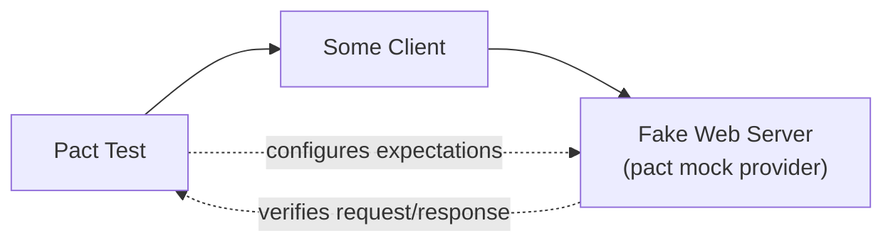

# Demo Pact Provider


This repository is the provider side of a small consumer-driven contract testing demo. It is an ASP.NET Core Web API that exposes a classic controller endpoint:

```http
GET /customers/{id}
```

The initial provider response is:

```json
{
  "id": 123,
  "name": "John",
  "email": "john@example.com",
  "phone": "555-1234"
}
```

## Architecture

- `DemoPactProvider.Api` contains the provider API.
- `CustomersController` returns a strongly typed `CustomerResponse`.
- `ProviderStatesController` accepts Pact provider-state setup calls at `/provider-states`.
- `DemoPactProvider.ContractTests` starts the real ASP.NET Core application on a local HTTP port, then runs PactNet verification against Pact files generated by the consumers.

## Consumer Flow

Each consumer repository owns its own expectations for `customer-provider`.

Consumers do not start or call the real provider when they create contracts. Instead, each consumer writes Pact tests around its own client code: the class, function, SDK wrapper, or other abstraction it uses to call the external provider API.

**What runs in production:**


**What the consumer Pact test exercises instead:**



The test never touches `Application Service` or the `Real Web Server`. It drives `Some Client` directly and points it at a Pact-managed fake server, so the resulting contract only pins down what the client actually sends and expects back.

In this demo:

- `demo-pact-consumer-ts` tests its TypeScript `CustomerClient`.
- `demo-pact-consumer-dotnet` tests its .NET `CustomerClient`.

Consumer CI runs the consumer Pact test:

1. The test starts a temporary Pact mock provider.
2. The test configures the mock provider with the HTTP request and response shape the consumer expects.
3. The real consumer client calls that mock provider, not the real provider application.
4. Pact checks that the client made the expected request.
5. Pact writes the generated contract to `pacts/`.
6. The generated Pact JSON is committed in the consumer repository.

The consumer Pact files are:

- `demo-pact-consumer-ts/pacts/typescript-consumer-customer-provider.json`
- `demo-pact-consumer-dotnet/pacts/dotnet-consumer-customer-provider.json`

These files are artifacts of the consumer tests. They are not manually authored.

> Committing generated Pact JSON files is the simplest transport mechanism for this demo.
> In a production setup, consumer CI should publish Pact files to a Pact Broker, and provider CI should fetch the contracts from the broker instead of checking out consumer repositories directly.

## Provider Flow In CI

The provider repository does not create or commit Pact JSON files. Provider CI gets the contracts by checking out the consumer repositories.

> In a production setup, provider CI should fetch contracts from a Pact Broker instead of checking out consumer repositories directly.

When `.github/workflows/verify-contracts.yml` runs for a provider pull request, it checks out:

- `demo-pact-consumer-ts` is checked out to `contracts/ts`
- `demo-pact-consumer-dotnet` is checked out to `contracts/dotnet`

That gives the provider workflow this contract layout:

- `contracts/ts/pacts/`
- `contracts/dotnet/pacts/`

Then `DemoPactProvider.ContractTests`:

1. Starts the real ASP.NET Core provider on a temporary local HTTP port.
2. Reads each Pact JSON file from the checked-out consumer folders.
3. Uses PactNet to send the requests from each Pact file to the real provider endpoint.
4. Compares the real HTTP response with each consumer contract.
5. Fails the workflow if any consumer contract is broken.

For local provider verification, the default Pact paths can be overridden with environment variables:

- `PACT_TS_PACT_DIR`
- `PACT_DOTNET_PACT_DIR`

## Demo Flow

Initial provider response:

- `id`
- `name`
- `email`
- `phone`

TypeScript consumer depends on:

- `id`
- `name`

.NET consumer depends on:

- `id`
- `email`

Demo change 1: remove `phone`.

Expected result:

- TypeScript consumer contract passes.
- .NET consumer contract passes.

Demo change 2: remove `name`.

Expected result:

- TypeScript consumer contract fails.
- .NET consumer contract passes.

## Run Locally

```powershell
dotnet restore
dotnet build --no-restore
dotnet test --no-build
```

Before Pact files exist locally, the contract tests report the missing local Pact directories and return successfully. In CI, missing Pact files fail the test run because `CI=true`.

To run against local consumer Pact files in custom locations:

```powershell
$env:PACT_TS_PACT_DIR = "C:\path\to\demo-pact-consumer-ts\pacts"
$env:PACT_DOTNET_PACT_DIR = "C:\path\to\demo-pact-consumer-dotnet\pacts"
dotnet test
```

## GitHub Actions

The workflow in `.github/workflows/verify-contracts.yml` checks out the consumer repositories from:

- `demo-pact-consumer-ts`
- `demo-pact-consumer-dotnet`
